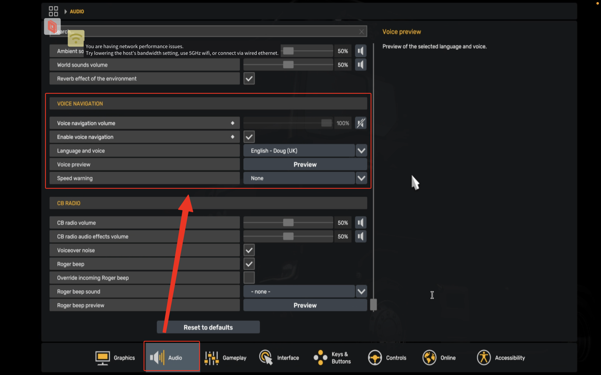

# Giọng chị Google trên ETS2/ATS trên TruckersMP

Cách sử dụng script tự động để cài đặt nhanh FMOD Navigation Voice Mod cho Euro Truck Simulator 2 (ETS2) và American Truck Simulator (ATS) trên TruckersMP.

## Chuẩn bị trước khi cài đặt

Trước khi chạy script, bạn cần cấu hình đường dẫn game và mức âm lượng mong muốn:
1. Mở tệp `configs/conf.ini`.
2. Cập nhật các thông số chính xác:
   - `ets2_root`: Đường dẫn đến thư mục cài đặt ETS2 (Ví dụ: `"D:/Steam/steamapps/common/Euro Truck Simulator 2"`).
   - `ats_root`: Đường dẫn đến thư mục cài đặt ATS (Ví dụ: `"D:/Steam/steamapps/common/American Truck Simulator"`).
   - `volume`: Mức âm lượng giọng nói mong muốn từ `0` đến `100` (Ví dụ: `75`).

---

## Hướng dẫn sử dụng trên Windows

Bạn có thể chạy cài đặt bằng **PowerShell** (Khuyến nghị) hoặc qua môi trường **Git Bash**.

### Cách 1: Sử dụng PowerShell (Nhanh & Tiện lợi nhất)
1. Nhấp chuột phải vào tệp `scripts/install.ps1`.
2. Chọn **"Run with PowerShell"** (Chạy bằng PowerShell).
3. *Lưu ý:* Nếu hệ thống chưa thiết lập đường dẫn game trong `conf.ini`, sẽ có hộp thoại hiện lên để bạn chọn thư mục gốc của game.

### Cách 2: Sử dụng Git Bash
- Config file `configs/conf.ini` trước khi chạy script.
```bash
./scripts/install.sh
```

## Quan trọng: Sau khi cài xong và vào game
- Cần phải cài đặt lại audio phần Voice navigation như sau

